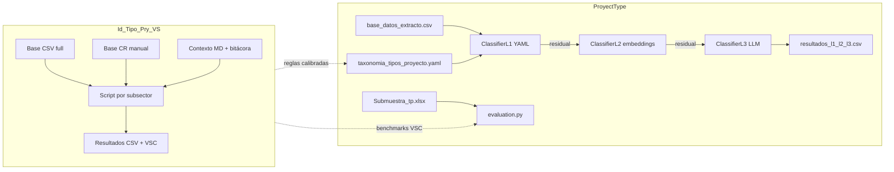

# Revisión extensa: proyecto legacy `Id_Tipo_Pry_VS` (copia 25_05)

**Fecha:** 2026-05-26  
**Proyecto revisado:** `/Users/felipecorrea/Downloads/Id_Tipo_Pry_VS - copia 25_05/`  
**Proyecto actual:** `/Users/felipecorrea/Vs/ProyectType/`  
**Objetivo:** Identificar arquitectura, aprendizajes y elementos rescatables del primer acercamiento a la clasificación de tipos de proyecto BIP.

---

## 1. Resumen ejecutivo

El proyecto legacy fue un **piloto sectorial bien documentado** para clasificar tipos de proyecto de inversión pública chilena usando reglas keyword por fases. Implementó clasificadores operativos en **5 subsectores** (Agua Potable, Educación Prebásica, Salud Baja Complejidad, Salud Media Complejidad, Justicia Rehabilitación Adultos) con resultados medibles y bitácoras de calibración iterativa.

ProyectType **generaliza y escala** ese enfoque: taxonomía unificada en YAML, motor L1 compartido (`scorer.py`), cascada L2 (embeddings) y L3 (LLM), evaluación contra submuestra manual y few-shot minados. La taxonomía actual cubre **16 sectores, 84 subsectores y 326 tipos**; el legacy operó solo sobre una fracción, pero acumuló **reglas de dominio muy refinadas** que aún no están plenamente reflejadas en el YAML ni en L1.

**Veredicto:** el legacy no debe reutilizarse como código base (scripts duplicados, sin paquete común), pero sí como **fuente de verdad para reglas, casos borde, documentación de proceso y benchmarks por subsector**.

| Dimensión | Legacy | ProyectType (actual) |
|-----------|--------|----------------------|
| Arquitectura | Silos por sector (`Sectores/*/Codigos/`) | Paquete `src/proyecttype/` + scripts CLI |
| Taxonomía | JSON nacional + MD por sector | `taxonomia_tipos_proyecto.yaml` |
| Clasificación | Regex + fases embebidas en cada script | L1 keywords → L2 embeddings → L3 LLM |
| Calibración | Manual pool (`Base_CR_Ex Ante.xlsx`) o certeza | `Submuestra_tp.xlsx` + `build_revision_manual.py` |
| Cobertura operativa | 5 subsectores calibrados | 326 tipos teóricos; calibración parcial |
| Base de datos | ~769k filas (`Base_clas_tipos_full.csv`) | ~9k filas (`base_datos_extracto.csv`) |
| Documentación | Excelente (INDEX, proceso, bitácoras) | `CLAUDE.md`, `docs/estructura_proyecto.md` |

---

## 2. Arquitectura del proyecto legacy

### 2.1 Organización de carpetas

```
Id_Tipo_Pry_VS - copia 25_05/
├── INDEX.md                         # Mapa del workspace + plantilla de extensión
├── Bases/                           # CSV full + script R de preparación
├── Contexto_General/                # Objetivos, NIP, proceso metodológico, taxonomía JSON
├── Datos/                           # Base CR (etiquetas manuales de referencia)
├── Sectores/                        # Núcleo operativo
│   └── {Sector}/
│       ├── Codigos/                 # Clasificador(es) Python standalone
│       ├── Clasificacion/           # Resultados por subsector
│       └── Contexto/                # Taxonomía MD, bitácoras, planes
└── Otros/                           # Prototipos R/Python, proceso histórico FC
```

Cada subsector sigue el patrón **Codigos → Clasificacion → Contexto**, con salidas estándar:

- `resultado_clasificacion_*.csv` — detalle por proyecto
- `resumen_clasificacion_*.csv` — conteos por tipo
- `proyectos_diferencia_tipo_manual_vs_codigo.*` — auditoría vs pool manual
- `Resultado_*_tipo_vsc.csv` — salida mínima (`CODBIP`, tipo, criterio)

### 2.2 Metodología común (documentada)

El documento maestro `Contexto_General/Proceso_Clasificacion_Tipos_Subsectores.md` define dos caminos de calibración:

1. **Con pool manual** (Agua Potable, Educación Prebásica, Salud BC): iteración reglas vs `Tipo_Pry` de `Base_CR_Ex Ante.xlsx`.
2. **Sin pool manual** (Salud MC, Justicia): señales fuertes/débiles, precedencias, métricas de certeza y revisión humana dirigida.

Pipeline universal por fases:

| Fase | Alcance textual | Propósito |
|------|-----------------|-----------|
| 0 | Nombre + descripción + descriptores | Excluir otros subsectores |
| 1 | Nombre + descriptores | Máxima precisión |
| 2 | + descripción + justificación + magnitud | Ampliar evidencia |
| 3–4 | + observaciones RATE | Último recurso |
| 5 | — | `NO CLASIFICADO` |

Resolución de conflictos: fuerza de señal → ubicación (nombre > descriptores > descripción) → precedencia por tipo.

### 2.3 Flujo de datos

```
Base_clas_tipos_full.csv (R: Bases_insumo_VSC.R)
  → dedupe por CODBIP (última HR_FECHA_RATE)
  → merge opcional Base_CR_Ex Ante.xlsx (Tipo_Pry)
  → inferencia/corrección BC_SUBSECTOR
  → clasificador por fases
  → exports estándar + Resultado_*_tipo_vsc.csv
```

Campos BIP priorizados (según `Contexto_General/Objetivos.md`):

1. `BC_NOMBRE` (máxima confianza)
2. `BC_DESCRIPTOR1–3`
3. `BC_DESCRIPCION`, `BC_JUSTIFICACION`
4. `BC_MAGNITUD`
5. `HR_OBSERVACIONES_RATE` (solo si hay duda)

---

## 3. Subsectores implementados y resultados

### 3.1 Agua Potable

**Script:** `Sectores/Agua_Potable/Codigos/clasificacion_proyectos_general.py`  
**Universo:** ~3.085 proyectos  
**NC:** ~4,2% (131/3.085)

| Tipo | Cantidad |
|------|----------|
| SISTEMA AGUA POTABLE RURAL | 2.610 |
| RED DE AGUA POTABLE RURAL | 193 |
| SISTEMA AGUA POTABLE URBANA | 109 |
| RED DE AGUA POTABLE URBANA | 42 |
| NO CLASIFICADO | 131 |

**Mecanismos distintivos del legacy:**

- `\bAPR\b`, `\bA\.P\.R\.\b`, SAPR/S.A.P.R. como señal directa de sistema rural
- `\bRED\b` con word boundary (evita falsos positivos en subcadenas)
- Fase 0 dura: RIEGO, PLUVIAL, ALCANT, FOSA, ESPIGÓN, DEFENSA MARÍTIMA, ALJIBE
- DESALINIZADORA/DESALADORA → sistema (no red)
- Fallback `INE_TIPO_COMUNA` cuando solo hay SISTEMA/RED sin rural/urban explícito
- Hasta 6 fases de ampliación textual

### 3.2 Educación Prebásica

**Script:** `Sectores/Educacion/Codigos/clasificacion_proyectos_educacion_prebasica.py`  
**Universo:** ~922 proyectos  
**NC:** ~4,4% (41/922; antes ~37% según minuta)

| Tipo | Cantidad |
|------|----------|
| JARDIN INFANTIL Y SALA CUNA | 664 |
| JARDIN INFANTIL | 182 |
| SALA CUNA | 35 |
| NO CLASIFICADO | 41 |

**Mecanismos distintivos:**

- Regex compuesto: `JARDIN(ES)? INFANTIL(ES)? (Y|/|E) SALA(S)? CUNA(S)?`
- Heurística: LACTANTE(S) + PARVULO(S)/NIVEL MEDIO → compuesto
- Siglas: N.M., N.T., J. INF., PREKINDER, VTF, PARVULARIA
- **Eliminación explícita** de AMAMANTAMIENTO/LACTANCIA como señal de Sala Cuna (falsos positivos)
- Fase 0: técnico profesional, museo, patrimonio
- Normalización sector 2024 (Educación vs Cultura y Patrimonio)

### 3.3 Salud — Baja Complejidad

**Script:** `Sectores/Salud/Codigos/clasificacion_proyectos_salud_baja_complejidad.py`  
**Universo:** ~2.519 proyectos  
**NC:** ~20% (506/2.519) — mayor brecha vs manual

| Tipo | Cantidad |
|------|----------|
| CESFAM | 620 |
| NO CLASIFICADO | 506 |
| POSTA RURAL | 420 |
| HOSPITAL BAJA | 414 |
| OTROS BC | 214 |
| CECOSF | 204 |
| SAR | 135 |
| SAPU-SUR | 16 |

**Mecanismos distintivos:**

- Precedencia: Hospital BC > SAR > SAPU/SUR > CECOSF > CESFAM > Posta
- SUR solo con `S.U.R.` o frase completa (no cardinal geográfico)
- CECOSF priorizado sobre CESFAM
- Fase 0 con **escape** si hay señal BC fuerte
- Patrones HFC, hospital comunitario, C.C.S.F.

### 3.4 Salud — Media Complejidad

**Script:** `Sectores/Salud/Codigos/clasificacion_proyectos_salud_media_complejidad.py` (v0.5)  
**Universo:** 2.017 registros  
**NC:** ~4,7% (95/2.017)  
**Certeza promedio (v0.4):** 0,858

| Tipo | Cantidad |
|------|----------|
| EQUIPOS/EQUIPAMIENTO MC | 1.162 |
| HOSPITAL MEDIANA COMPLEJIDAD | 478 |
| NO CLASIFICADO | 95 |
| COSAM | 51 |
| CAE | 49 |
| SAMU | 46 |
| UTI | 36 |
| CRS | 34 |
| DIALISIS | 34 |
| OTROS MC | 32 |

**Mecanismos distintivos (el clasificador más sofisticado del legacy):**

- `TYPE_RULES` con regex **strong/weak** por tipo
- Scoring: fuerza × peso por ubicación × prioridad de tipo
- Equipamiento **solo en nombre** (v0.2+; reducción masiva de FP)
- Guard `Procesos.xlsx`: `[OTRO PROCESO] Y EQUIPAMIENTO` ≠ tipo equipamiento
- Exclusión estacionamiento + ambulancia/vehículos
- UCI aislado → UTI
- Tokens médicos: SCOPIO, GRAFO, ADQUISICION, AMBUL. como señales fuertes
- Fase 0 solo en nombre (117 → 39 excluidos entre v0.3 y v0.4)
- Excel de revisión por nivel de certeza (ALTA/MEDIA/BAJA)

### 3.5 Justicia — Rehabilitación Adultos (v2)

**Script:** `Sectores/Justicia/Codigos/clasificacion_proyectos_justicia_rehabilitacion_adultos_v2.py`  
**Universo:** ~655 proyectos  
**NC:** ~6,9% (45/655)  
**Certeza promedio (v2):** 0,912

| Tipo | Cantidad |
|------|----------|
| CDP | 164 |
| CCP | 136 |
| CP | 126 |
| CRS | 109 |
| NO CLASIFICADO | 45 |
| CET | 34 |
| CPF | 27 |
| RED INCENDIO | 8 |
| CAIS | 5 |
| UEAS | 1 |

**Mecanismos distintivos:**

- Siglas con puntos opcionales: `C\.?D\.?P\.?`, etc.
- Typos de reinserción: REISERCION, REIUNSERCION, RINSERCION, READAPTACION
- CIP con word boundary (no “PRINCIPALMENTE”)
- TRIBUNAL/JUZGADO excluidos solo si están en **nombre**
- RED CONTRA INCENDIO en nombre → gana siempre
- v2: resolución de conflictos por ubicación de señal más fuerte, no solo precedencia
- Señales pendientes documentadas: PATRONATO→CAIS, CENTRO ABIERTO→CRS, C.O.F.→CPF

---

## 4. Comparación con ProyectType

### 4.1 Lo que ProyectType ya absorbe

| Elemento legacy | Equivalente en ProyectType |
|-----------------|----------------------------|
| Taxonomía nacional | `data/taxonomy/taxonomia_tipos_proyecto.yaml` (desde mismo Excel fuente) |
| Normalización NFD + mayúsculas | `text_utils.normalize_text()` + word boundaries en tokens |
| Tipos compuestos (JI + SC) | `composite.py` + `composites_index.csv` + few-shot L3 |
| Pares confusos | `colisiones_keyword.csv` + inyección en prompt L3 |
| Evaluación vs manual | `evaluation.py` + `Submuestra_tp.xlsx` |
| Prioridad nombre > descripción | L1: `strong_nombre=3`, `strong_desc=2` |
| Exclusiones por keyword | Campo `excluye_si_contiene` en modelo (`taxonomy.py`) |
| Few-shot por dominio | `few_shot_examples.yaml`, `few_shot_mined.yaml` |
| Aliases sector/subsector | `aliases.py` |

### 4.2 Brechas importantes (oportunidades de rescate)

#### A. Keywords YAML genéricos vs regex calibrados

La taxonomía actual para subsectores piloto usa keywords derivadas de definiciones oficiales (p. ej. Agua Potable: `rural`, `sistema`, `red`), pero **no incluye** señales operativas calibradas:

- Agua Potable: `APR`, `SAPR`, `DESALINIZADORA`, `ADUCCION`, `SSR`, `COLECTIVO`
- Educación Prebásica: `N.M.`, `PREKINDER`, `VTF`, `PARVULARIA`, `SALACUNA`
- Salud BC: `HFC`, `HOSPITAL FAMILIAR`, patrones abreviados CESFAM/CECOSF
- Salud MC: decenas de regex médicas (SCOPIO, GRAFO, UCI→UTI, etc.)
- Justicia: typos, siglas punteadas, reglas de nombre exclusivo

**Impacto:** L1 en ProyectType probablemente underperforma vs legacy en estos subsectores, especialmente Agua Potable (combinación sistema/red × rural/urban) y Salud MC (equipamiento).

#### B. Fase 0 a nivel subsector no implementada en L1

El legacy rechaza proyectos enteros si detecta conceptos de otro subsector (ALCANT en Agua Potable, museo en Educación, alta complejidad en Salud BC). ProyectType tiene `excluye_si_contiene` en el modelo pero **el YAML no lo usa aún** (0 entradas encontradas).

#### C. Fallback `INE_TIPO_COMUNA`

Usado extensamente en Agua Potable legacy para desambiguar rural/urban cuando solo aparece SISTEMA o RED. ProyectType **no consume** este campo en el pipeline actual.

#### D. Reglas contextuales no expresables en keywords simples

- Salud MC: equipamiento solo en nombre; guard de procesos; estacionamiento+ambulancia
- Justicia: exclusiones condicionadas a ubicación del match
- Agua Potable: RED gana sobre SISTEMA en ciertas combinaciones; APR sin RED → sistema rural

Estas reglas requieren **lógica procedural** o extensiones del scorer (no solo más keywords).

#### E. Métricas de certeza pre-LLM

El legacy calculaba `CERTEZA_TIPO`, `NIVEL_CERTEZA`, `N_MATCHES` para priorizar revisión humana sin gold standard. ProyectType delega ambigüedad a L2/L3 pero no expone un score de certeza L1 comparable para triage.

#### F. Documentación operativa

El legacy tiene bitácoras caso a caso, checklists de corrida, planes de extensión sectorial y plantilla INDEX para escalar. ProyectType tiene documentación técnica del cascade pero **no** bitácoras de calibración por subsector.

#### G. Base de datos y benchmarks

- Legacy: universo completo (~769k filas) con resultados CSV por subsector
- ProyectType: extracto ~9k filas; benchmarks legacy no integrados

---

## 5. Inventario de activos rescatables

### 5.1 Alta prioridad — reglas y conocimiento de dominio

| Fuente | Qué rescatar | Destino sugerido en ProyectType |
|--------|--------------|----------------------------------|
| `clasificacion_proyectos_general.py` | APR boundary, Fase 0, DESALINIZADORA, INE fallback | Keywords YAML + regla L1 especial o few-shot L3 |
| `clasificacion_proyectos_educacion_prebasica.py` | Regex compuesto, anti-patterns lactancia | `composite.py` / keywords / `excluye_si_contiene` |
| `clasificacion_proyectos_salud_baja_complejidad.py` | Precedencias, SUR restringido, escape Fase 0 | Extender `ScorerConfig` o reglas post-score |
| `clasificacion_proyectos_salud_media_complejidad.py` | TYPE_RULES, guard procesos, equipamiento-en-nombre | Módulo `rules_salud_mc.py` o enriquecer L3 + L1 |
| `clasificacion_proyectos_justicia_rehabilitacion_adultos_v2.py` | Siglas, typos, reglas por ubicación | Keywords + casos borde en `l3.yaml` |
| Bitácoras sectoriales | Casos concretos (IDs BIP, iteraciones) | `few_shot_mined.yaml`, tests unitarios L1 |
| `Procesos.xlsx` (Salud) | Lista procesos para guard equipamiento | `data/taxonomy/procesos_salud.yaml` |

### 5.2 Media prioridad — proceso y datos

| Fuente | Qué rescatar | Destino sugerido |
|--------|--------------|------------------|
| `Proceso_Clasificacion_Tipos_Subsectores.md` | Metodología dual (con/sin pool) | `docs/metodologia_clasificacion.md` |
| `Objetivos.md` | Prioridad de campos BIP | Ya alineado; validar en L1 field weighting |
| `INDEX.md` | Plantilla extensión sector | Adaptar a flujo YAML + tests |
| `Base_CR_Ex Ante.xlsx` | Etiquetas CR adicionales | Comparar/complementar `Submuestra_tp.xlsx` |
| CSVs `proyectos_diferencia_*` | Casos donde legacy acertó vs manual | Benchmark para calibrar L1 |
| `Resultado_*_tipo_vsc.csv` | Clasificaciones legacy congeladas | Regression tests por subsector |

### 5.3 Baja prioridad — referencia histórica

| Fuente | Notas |
|--------|-------|
| `Otros/Codigos_iniciales/Traz_Id_Tipo_Pry_VS.py` | Prototipo indicadores + combinatoria; superado |
| `Otros/Proceso_FC/` | Proceso consultoría FC; muestras pequeñas |
| `Bases_insumo_VSC.R` | Pipeline R; ProyectType usa CSV directo |
| `manual_chunk_*.txt` | Manual SNIP chunked; contexto L3 si hace falta |

### 5.4 Taxonomía de referencia

`Contexto_General/tipos_proyectos.json` — 17 sectores en JSON. ProyectType tiene 16 sectores / 326 tipos en YAML (misma fuente Excel). Útil para **auditoría de completitud**, no para reimportar tal cual.

---

## 6. Casos borde documentados (checklist de migración)

Estos casos aparecen repetidamente en bitácoras y scripts; conviene verificarlos explícitamente en ProyectType:

### Agua Potable

- [ ] `\bAPR\b` no debe matchear “APRUEBA”
- [ ] Proyecto con ALCANT/RIEGO/PLUVIAL → no clasificar en Agua Potable
- [ ] DESALINIZADORA → sistema rural, no red
- [ ] Solo “SISTEMA” sin rural/urban → usar INE_TIPO_COMUNA si disponible
- [ ] RED + rural sin SISTEMA → RED RURAL (prioridad sobre sistema)

### Educación Prebásica

- [ ] “Jardín infantil y sala cuna” → tipo compuesto
- [ ] LACTANTES + PARVULOS → heurística compuesto
- [ ] AMAMANTAMIENTO / LACTANCIA → **no** activan Sala Cuna
- [ ] Proyectos museo/patrimonio → excluir de prebásica

### Salud BC

- [ ] “SUR” geográfico (sector sur) ≠ Servicio de Urgencia Rural
- [ ] CECOSF vs CESFAM: priorizar CECOSF si ambos matchean
- [ ] Hospital BC (HFC) vs CESFAM genérico

### Salud MC

- [ ] “AMPLIACION Y EQUIPAMIENTO” → no es tipo equipamiento
- [ ] Equipamiento inferido solo desde descripción → evitar FP
- [ ] UCI aislado → UTI, no equipamiento
- [ ] Estacionamiento para ambulancias → no equipamiento MC

### Justicia

- [ ] CIP como sigla vs substring de “PRINCIPALMENTE”
- [ ] TRIBUNAL en descripción ≠ exclusión
- [ ] RED CONTRA INCENDIO en nombre → tipo dedicado
- [ ] Typos REINSERCIÓN / READAPTACIÓN
- [ ] PATRONATO → CAIS; CENTRO ABIERTO → CRS

---

## 7. Propuesta de plan de rescate (priorizado)

### Fase 1 — Quick wins (1–2 días)

1. **Enriquecer YAML** de los 5 subsectores piloto con keywords calibradas extraídas de los scripts legacy (APR, SAPR, siglas, typos).
2. **Poblar `excluye_si_contiene`** en tipos/subsectores con listas Fase 0 del legacy.
3. **Importar casos diff** de `proyectos_diferencia_*` como tests en `tests/test_classifier_l1.py`.
4. **Copiar `Procesos.xlsx`** a `data/taxonomy/` para futura regla equipamiento Salud MC.

### Fase 2 — Reglas estructurales (3–5 días)

1. Extender L1 con **pesos por campo** configurables por subsector (equipamiento solo nombre en Salud MC).
2. Implementar **subsector guard** (Fase 0 global antes de scoring).
3. Añadir soporte opcional de **`INE_TIPO_COMUNA`** en pipeline para Agua Potable.
4. Portar precedencias Salud BC y Justicia como `tipo_priority` en YAML o post-processor.

### Fase 3 — Benchmark y documentación (2–3 días)

1. Correr ProyectType L1 sobre subconjuntos legacy (por subsector) y comparar con `Resultado_*_tipo_vsc.csv`.
2. Documentar brecha L1 vs legacy vs manual en Excel de revisión.
3. Migrar bitácoras clave a `docs/bitacoras/` (resumen, no copia íntegra).
4. Minar few-shot L3 desde casos donde legacy acertó y L1 falla.

### Fase 4 — Cobertura nacional

1. Usar MD de contexto sectorial (`Clasificacion_Sectores_Subsectores_Tipos_*.md`) como insumo para prompts L3 de subsectores no calibrados.
2. Aplicar plantilla INDEX adaptada: YAML entry + tests smoke + few-shot mínimo.

---

## 8. Archivos clave del legacy (referencia rápida)

### Metodología y contexto

| Archivo | Descripción |
|---------|-------------|
| `INDEX.md` | Mapa del workspace |
| `Contexto_General/Proceso_Clasificacion_Tipos_Subsectores.md` | Metodología maestra |
| `Contexto_General/Objetivos.md` | Objetivos y campos BIP |
| `Contexto_General/tipos_proyectos.json` | Taxonomía nacional JSON |

### Clasificadores de producción

| Archivo | Subsector |
|---------|-----------|
| `Sectores/Agua_Potable/Codigos/clasificacion_proyectos_general.py` | Agua Potable |
| `Sectores/Educacion/Codigos/clasificacion_proyectos_educacion_prebasica.py` | Educación Prebásica |
| `Sectores/Salud/Codigos/clasificacion_proyectos_salud_baja_complejidad.py` | Salud BC |
| `Sectores/Salud/Codigos/clasificacion_proyectos_salud_media_complejidad.py` | Salud MC |
| `Sectores/Justicia/Codigos/clasificacion_proyectos_justicia_rehabilitacion_adultos_v2.py` | Justicia RA |

### Bitácoras

| Archivo | Contenido |
|---------|-----------|
| `Sectores/Agua_Potable/Contexto/bitacora_clasificacion_agua_potable.md` | Iteraciones AP |
| `Sectores/Educacion/Contexto/minuta_acciones.md` | Log detallado Educación |
| `Sectores/Salud/Contexto/bitacora_extension_clasificacion_salud.md` | Evolución Salud MC v0.1→v0.5 |
| `Sectores/Justicia/Contexto/bitacora_clasificacion_justicia.md` | Evolución Justicia v1→v2 |

### Datos

| Archivo | Descripción |
|---------|-------------|
| `Bases/Base_clas_tipos_full.csv` | Universo BIP (~769k filas) |
| `Datos/Base_CR_Ex Ante.xlsx` | Etiquetas manuales CR |
| `Sectores/Salud/Contexto/Procesos.xlsx` | Procesos para guard equipamiento |

---

## 9. Conclusiones

1. **El legacy no está obsoleto en conocimiento de dominio.** Los 5 clasificadores representan cientos de horas de calibración con evidencia cuantitativa (NC%, certeza, diffs vs manual).

2. **ProyectType tiene mejor ingeniería de software** (cascade unificado, tests, YAML, L2/L3), pero **hereda keywords genéricas** que no capturan la precisión alcanzada en el piloto.

3. **El rescate más valioso no es copiar scripts**, sino:
   - extraer reglas a YAML / extensiones del scorer,
   - convertir diffs en tests de regresión,
   - usar bitácoras para few-shot y casos borde L3,
   - benchmark contra `Resultado_*_tipo_vsc.csv`.

4. **Salud Media Complejidad y Justicia v2** son los activos técnicos más sofisticados: reglas por ubicación, certeza y guards contextuales que L1 actual no replica.

5. **Salud Baja Complejidad** tiene el peor NC (~20%) en legacy; conviene tratarlo como subsector difícil donde L2/L3 aportan más que portar reglas L1 sin reevaluar.

6. **La documentación de proceso del legacy** (`Proceso_Clasificacion_*.md`, INDEX, checklists) merece migrarse a `docs/` como complemento metodológico del cascade actual.

---

## 10. Anexo: evolución arquitectónica (diagrama)



---

*Documento generado como parte de la revisión de continuidad entre el piloto sectorial y la arquitectura unificada ProyectType.*
